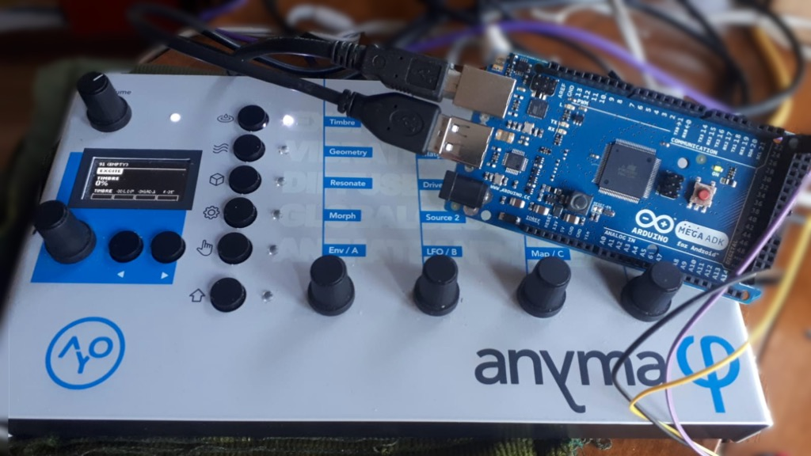

# Anyma HW Pal

A hardware friend for MIDI recording with Aodyo Anyma Phi

## The problem

It's not possible to "just jam" with Anyma Phi whilst a MIDI sequencer captures your patch edits and state changes. Some messages over DIN MIDI ports are ignored, and patch state changes may not be simply recorded/edited. 

* Anyma wants MIDI CC.
* Your MIDI sequencer edits CC.
* Anyma sends SYSEX.
* Anyma ingores some SYSEX previously transmitted.

## This solution
Connect an Arduino (Mega ADK) to workaround firmware quirks, allowing full use of Anyma DIN MIDI ports with CC.

Simply record output from Anyma DIN and your controller during a "take" where you are adjusting Anyma parameters.

* Pal converts SYSEX to CC.
* Anyma receives CC.
* Your MIDI sequencer edits CC.
* Everyone is happy.

## Extra info
A (pullup) toggle switch connected to Digital Pin 22 allows switching between `EDITOR CONNECTED` and `EDITOR DISCONNECTED` modes. 

AnymaPal requests and relays your patch to Anyma DIN MIDI ports (so you can capture the entire Anyma state in your sequencer before each take).

Happy recording! :)

 
__________

v1.3.1 of USB HOST Library is tested extensively and successfully. Replace `USB_Midi.h` with supplied version to set `MIDI_MAX_SYSEX_SIZE 1024`.
